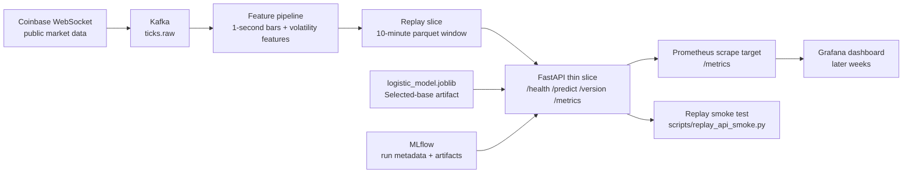

# System Diagram

## Week 4 Thin Slice

## Interpretation
- **Live ingestion exists in the repo already**, but the Week 4 prototype intentionally runs the API in replay mode.
- **Kafka and MLflow still come up through Docker Compose** so the thin slice matches the later production path.
- **The FastAPI service loads a 10-minute replay window** from the current feature store and exposes prediction plus monitoring endpoints.
- **Prometheus/Grafana are represented in the interface contract now** through `/metrics`, even though the full dashboard stack can come in later weeks.

## What This Diagram Commits The Team To
- No model retraining inside the API thin slice
- No live websocket dependency for the Week 4 demo path
- One selected-base model artifact for the first service version
- Monitoring-compatible API surface from the first prototype
