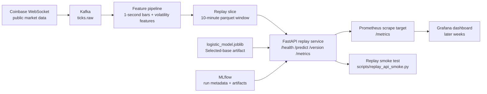

# System Diagram

## Final Service Architecture

## Interpretation
- **Live ingestion exists in the repo already**, while the packaged API path serves predictions from a replay slice for the stable demo flow.
- **Kafka and MLflow still come up through Docker Compose** so the shipped stack matches the repo's end-to-end operating path.
- **The FastAPI service loads a 10-minute replay window** from the current feature store and exposes prediction plus monitoring endpoints.
- **Prometheus/Grafana are part of the delivered observability surface** through `/metrics` and the provisioned dashboards.

## What This Diagram Commits The Repo To
- No model retraining inside the API service
- No live websocket dependency on the packaged replay-mode demo path
- One selected-base model artifact for the shipped service version
- Monitoring-compatible API surface with bundled observability assets
