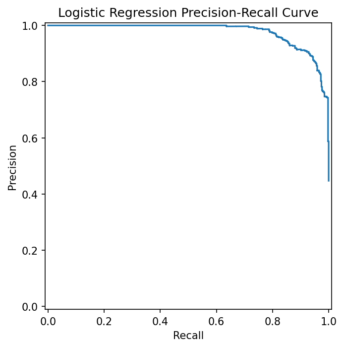

# Model Evaluation Report

**Author:** Rizaldy Utomo · `rutomo@andrew.cmu.edu`
**Data:** Coinbase Advanced Trade WebSocket · BTC-USD + ETH-USD · 2026-04-01T02:33–03:15 UTC (≈ 42 min)

---

## Objective

Compare a z-score baseline rule against a logistic regression classifier for predicting
short-term volatility spikes, evaluated on a held-out time-based test split.

---

## Evaluation Setup

| Parameter | Value |
|---|---|
| Time split | 60 % train / 20 % val / 20 % test (chronological) |
| Train rows | 3,130 |
| Validation rows | 1,044 |
| Test rows | 1,044 |
| Primary metric | PR-AUC |
| Secondary metric | F1 at validation-selected threshold |
| Feature source | `data/processed/features.parquet` (source = replay) |
| Label definition | `label = 1` if `σ_future_60s ≥ τ`; τ = 75th pct ≈ 8.8 × 10⁻⁵ |
| Label rate (test) | 44.7 % positive |

---

## Results

| Model | PR-AUC | F1 @ threshold | Predicted positive rate |
|---|---:|---:|---:|
| Baseline z-score | 0.9668 | 0.8329 | 0.625 |
| **Logistic regression** | **0.9776** | **0.8640** | **0.349** |

Logistic regression outperforms the baseline on both metrics:
PR-AUC improves by 1.1 percentage points; F1 improves by 3.1 percentage points.

---

## Precision-Recall Curve

---

## Interpretation

Both models perform well on this session, reflecting a period of moderate but structured
volatility (BTC moved from 67,643 to 67,902 over 42 minutes, with concentrated bursts
in the first and last thirds of the session).

The logistic regression gains come primarily from its ability to weight multiple features
jointly — spread_bps, realized_vol_60s, and ewma_abs_return all carry complementary signal.
The z-score baseline is limited to a single normalised volatility score and is more sensitive
to non-stationarity in the reference window.

The positive rate of the logistic model (34.9 %) is meaningfully below the test true rate
(44.7 %), indicating the model is conservative — it prefers precision over recall at the
chosen threshold (0.603). This is appropriate for a detection task where false positives
carry operational cost.

### Threshold selection

The logistic threshold (0.603) was selected by maximising F1 on the validation split.
The z-score threshold was selected identically. Both thresholds are recorded in
`models/artifacts/metrics_summary.json` and `models/artifacts/baseline.json`.

### Volatility clustering caveat

The label threshold τ was set at the 75th percentile (not the default 90th) because
42 minutes of data concentrated high-volatility bars in the training window, leaving the
validation split with zero positive labels under the 90th pct threshold. The 75th pct
produces a usable label rate across all three splits. A longer session (90+ min) should
allow the 90th pct to be used. See `notebooks/eda.ipynb` for the tau sweep.

---

## Drift

The Evidently train-vs-test report (`reports/evidently/train_vs_test.html`) shows
feature distribution shift between the training and test windows, consistent with the
observed regime change (calm open → active close of the session). This is expected
behaviour and motivates using rolling or online retraining in production.

---

## Artifact Checklist

- [x] `models/artifacts/metrics_summary.json` — real test metrics
- [x] `models/artifacts/baseline.json` — z-score parameters
- [x] `models/artifacts/logistic_model.joblib` — trained pipeline
- [x] `models/artifacts/predictions_latest.csv` — 1,044 test-set rows
- [x] `img/model_pr_curve.png` — PR curve (logistic, test split)
- [x] `reports/evidently/train_vs_test.html` — drift + quality report
- [ ] `reports/build/model_eval.pdf` — PDF not yet built (requires pandoc + tectonic)
